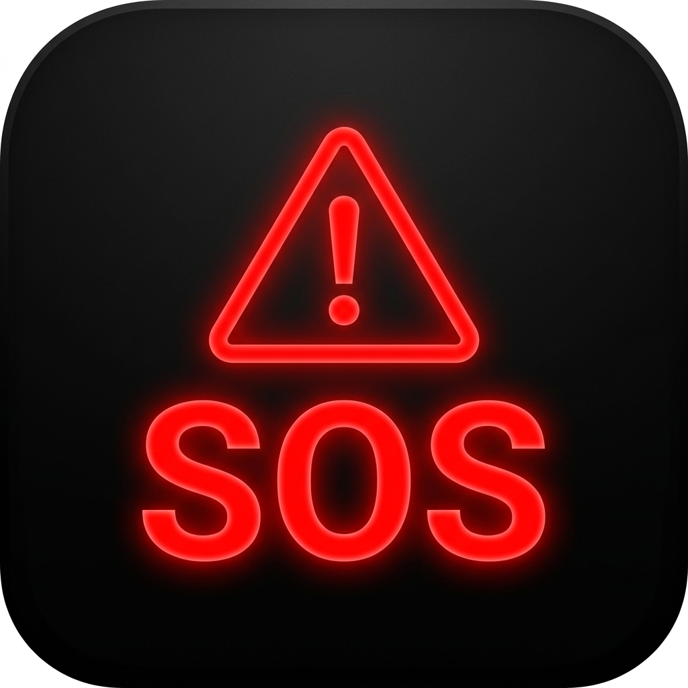

# 🚨 S.O.S Panic Button — Flutter App

<p align="center">
  
</p>

An offline emergency app for mountain climbers, hikers, and general outdoor survival.  
100% Offline · GPS · Compass · SMS · Flash Strobe · Siren · AI (Optional)

---

## 📁 Project Structure

```
sos_flutter/
├── lib/
│   ├── core/
│   │   ├── theme/          → AppColors, AppTheme
│   │   ├── constants/      → (additional: emergency numbers, etc.)
│   │   └── utils/          → (additional: formatters, validators)
│   ├── data/
│   │   ├── models/         → EmergencyContact, ActivityLog (Hive)
│   │   ├── repositories/   → GpsRepository, CompassRepository, SmsRepository
│   │   └── datasources/    → GeminiService (Google AI Studio)
│   ├── domain/
│   │   ├── entities/       → (additional: pure entities for Clean Architecture)
│   │   └── usecases/       → (additional: ActivateSOS, SendSmsUseCase, etc.)
│   └── presentation/
│       ├── screens/        → SosScreen, CompassScreen
│       ├── widgets/        → (additional: reusable widgets)
│       └── providers/      → SosProvider, ActivityLogProvider
├── android/
│   └── app/src/main/AndroidManifest.xml  → Permissions & configuration
├── assets/
│   ├── audio/siren.mp3    → [Add yourself: siren audio file]
│   └── data/              → [Add: offline survival tips JSON]
└── pubspec.yaml           → Dependencies configuration
```

---

## 🚀 Setup & Run

### 1. Prerequisites
```bash
flutter --version  # >= 3.19.0
dart --version     # >= 3.3.0
```

### 2. Install dependencies
```bash
cd SOS
flutter pub get
```

### 3. Generate Hive adapters
```bash
flutter pub run build_runner build --delete-conflicting-outputs
```
> This generates the code files: `emergency_contact.g.dart` and `activity_log.g.dart`

### 4. Add Audio Asset
Place an audio file named `siren.mp3` in the `assets/audio/` directory.  
You can download one for free from freesound.org (CC0 license) — search for "emergency siren".### 5. Configure AI Provider Integrations (Gemini, Claude, Grok)
SIGMA supports multiple premium AI engines. You can easily switch between providers directly in the app's AI tab:
* **Gemini 2.0 Flash** (powered by Google AI Studio)
* **Claude 3.5 Sonnet** (powered by Anthropic Console)
* **Grok 2** (powered by xAI)

Open the app, navigate to the **AI** tab, tap the active model selector to choose your provider, tap **Settings (Gear Icon)** in the top right, and paste your API key. Keys are securely stored locally on your device's `SharedPreferences` and remain persistent across sessions.

### 6. Run on Android
```bash
flutter run -d android
# or build the release APK:
flutter build apk --release
```

### 7. Run on iOS
```bash
# Add to ios/Runner/Info.plist:
# NSLocationWhenInUseUsageDescription
# NSLocationAlwaysUsageDescription  
# NSSensorUsageDescription (for compass)

flutter run -d ios
```

---

## 📱 Permissions (Android)

All required permissions are already configured in the `AndroidManifest.xml` file:

| Permission | Purpose |
|-----------|---------|
| `ACCESS_FINE_LOCATION` | High-precision GPS tracking |
| `SEND_SMS` | Send emergency SMS messages in the background |
| `CAMERA` | Access LED torch for Morse code SOS strobe |
| `VIBRATE` | Haptic feedback for SOS interactions |
| `FOREGROUND_SERVICE` | Keeps GPS active when the app is in the background |
| `INTERNET` | API requests for Gemini, Claude, and Grok integrations |

---

## 🧠 SIGMA AI Assistant — System Architecture

SIGMA is configured as an elite wilderness and rescue assistant. The conversational brain dynamically supports Google, Anthropic, and xAI architectures with conversational history tracking (up to last 7 messages for conversational memory).

Key prompt directions:
- wilderness survival tactics (water extraction, signaling, shelter)
- mountain & jungle navigation (compass, terrain reading, stars)
- emergency first aid (hypothermia, fractures, bleeding, altitude sickness)
- Morse code and whistle signal interpretations
- Low-latency HTTP/SDK streaming integrations

---

## 🗺️ Roadmap & Current Status

- [x] **SOS Button + Countdown** (anti-mispress protection with hold-to-activate)
- [x] **Real-time GPS Tracking** (streamed directly to main console)
- [x] **Location Info & Google Maps** (tap for detailed coordinates and launch maps app via `geo:` protocol)
- [x] **Emergency SMS** (sends instant SMS with coordinates to primary contacts)  
- [x] **Digital Compass** (magnetometer-based orientation tracking)
- [x] **Morse Code SOS LED Strobe Light** (hardware camera integration for visual beacons)
- [x] **Loud Emergency Siren Audio** (high-frequency siren)
- [x] **Sigma AI Assistant Screen** (active chat UI, Gemini 2.0 Flash, quick prompt suggestions)
- [x] **Contacts Management Screen** (full Hive-backed CRUD operations for contacts)
- [x] **Activity Log Screen** (persistent database recording SOS and sensor trigger logs)
- [x] **Offline Reverse Geocoding** (points database lookup)
- [x] **Background GPS Foreground Service** (continues updating location in background)
- [x] **Custom App Launcher Icon** (branded dark SOS launcher icon with red warning theme)

---

## ⚠️ Important Considerations

- **SMS**: Requires GSM network signal (does not need internet). It works even at 0 bars of data as long as there is basic GSM coverage.
- **GPS**: Works completely offline. GPS lock is faster and more precise in open areas.
- **Compass**: Calibrate by waving the phone in a figure-8 motion in the air. Keep it away from metal items and powerbanks.
- **AI Integration**: Requires an internet connection. The offline mode operates using local cached survival tips.

---

## 📞 Emergency Contacts (Indonesia & Global)

| Number | Service |
|-------|---------|
| **112** | National Emergency (all-in-one) / Universal European |
| **911** | Universal US/Global Emergency |
| **115** | Basarnas / Search & Rescue (SAR) |
| **119** | Ambulance |
| **113** | Fire Department |
| **110** | Police |
